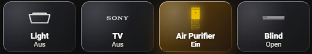

# FrostGlass UI

An elegant, "Frosted Glass" inspired dashboard design for Home Assistant. FrostGlass UI leverages CSS backdrop filters and smooth gradients to create a high-quality, floating look without sacrificing readability.

**Created with ❤️ by Landako1. If you like this project, please ⭐ the repository!**

---

## 📸 Preview

| Dark Mode |
| :--- |
|  |

---

## ✨ Features

* **Frost Effect:** Integrated transparency using `backdrop-filter` for a genuine glass aesthetic.
* **Modern Styling:** Rounded corners, soft shadows, and subtle borders.
* **Easy Configuration:** Based on `button-card` templates – configure once, reuse everywhere.
* **Reactive:** Visual status indicators with customized glow effects.

---

## ⚠️ Prerequisites

Since this design relies on trusted components, you must have the following cards installed via HACS first. **Note:** The `button-card` (by RomRider) must be installed via HACS, otherwise the template will not load:

* [button-card](https://github.com/custom-cards/button-card)
* [card-mod](https://github.com/thomasloven/lovelace-card-mod)

---

## 🚀 Installation & Usage

### 1. Installation via HACS (Recommended)

[](https://my.home-assistant.io/redirect/hacs_repository/?owner=Landako1&repository=frostglass-ui&category=plugin)

*(If the badge doesn't work: Open HACS -> Three dots (top right) -> Custom repositories -> Add URL: `https://github.com/Landako1/frostglass-ui` -> Category: Dashboard)*

### 2. Include the Templates
Open your Home Assistant Dashboard, click the **three dots** in the top right corner, and select **Raw configuration editor**. Add the following line at the very top of your file:

```yaml
button_card_templates: !include /config/www/community/frostglass-ui/button_card_templates.yaml
```
### 3. Create your first FrostGlass Button
Now you can create beautiful buttons with minimal code. Simply use the template key:

```yaml
type: custom:button-card
template: frost_blue_button
entity: light.living_room
name: Living Room
icon: mdi:lamp
```
### 4. Pro-Tip: Stacking
To create your own frosted glass layout, wrap your buttons in a vertical-stack or horizontal-stack:
```yaml
type: vertical-stack
cards:
  - type: horizontal-stack
    cards:
      - type: custom:button-card
        template: frost_blue_button
        entity: light.living_room
      - type: custom:button-card
        template: frost_blue_button
        entity: light.kitchen
```
## 📄 License
This project is released under the **MIT License**.
